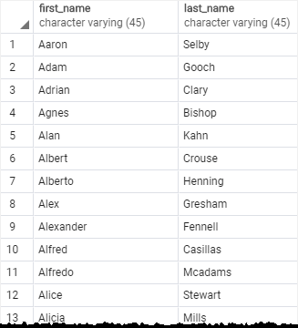
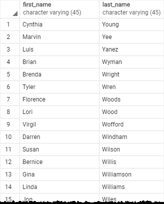
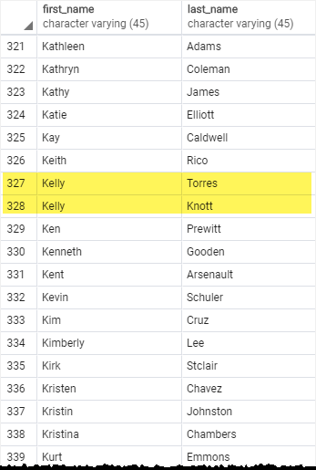
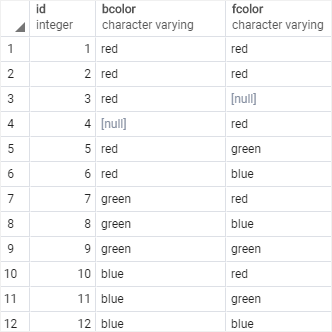
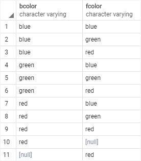
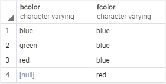

# Django-Study

# TIL 21/02/17
## Two Scoops of Django

### CH 1. 코딩 스타일
  - PEP 8 (flake8 library 사용하면 더 쉽게 따를 수 잇음)
  - 79 칼럼 제약
  - url pattern 의 name 에는 (-) 대신 (_) 사용

### CH 2. 최적화된 장고 환경 꾸미기

 - 로컬 환경과 운영 환경에서 같은 DB 사용하기 (PostgreSQL 추천)
 - virtualenv 을 이용한 파이썬 라이브러리 의존성 유지
 - version control (git)
 - 프로젝트 개발 팀원 모두에게 똑같은 개발 환경 제공 (Virtual Box or Vagrant or Doker)

### CH 3. 어떻게 장고 프로젝트를 구성할 것인가
  - 쿠키커터로 프로젝트 구성 템플릿 만들기
  - pip install cookiecutter
  - cookiecutter gh:pydanny/cookiecutter-django (원래 하던 것 보다 훨씬 파일이 생겼다... 너무 많은데?)
  - [cookie cutter 참고](https://medium.com/@jsh901220/django%EC%99%80-cookiecutter-django-%EA%B0%84%EB%8B%A8-%EC%84%A4%EB%AA%85-898d063d38ff
)

### CH 4. 장고 앱 디자인의 기본
 - 각 장고 앱은 그 앱 자체가 지닌 한 가지 역할에 초점이 맞추어져야 하며 단순하고 쉽게 기억되는 이름을 가져야 한다.
 - 앱의 기능이 너무 복잡하다면 여러 개의 작은 앱으로 나눈다.

### CH 5. settings 와 requirements 파일

 - settings 의 Secret Key 는 환경 변수에 보관한다. (찾아보니 어려워서 json 파일에 보관 후 .gitignore 에 추가하기로 함)
 - requirements 와 settings 파일은 베이스, 로컬, 배포 환경 각각을 구분하여 만든다.
 - settings 에서 경로를 지정할 때 BASE_DIR 을 적극 이용한다.

### CH 6. 장고에서 모델 이용하기

 - 모델 상속 abstract base class, multi-table inheritance, proxy model
   ```text
   모델 사이에서 중복되는 내용이 최소라고 한다면 모델의 상속이 필요없다.
   모델들 사이에 중복된 필드가 많을 때, 추상화 기초 모델 (abstract base class) 을 사용한다.
   ```
 - 장고 모델 정규화 (데이터베이스 정규화) 필수임 필수
 - 거대 모델 [거대 모델을 다루는 방법](https://americanopeople.tistory.com/304)
거대 모델, Model Manager, mixins, utils, view, query
   
## 클린 코드를 위한 테스트 주도 개발

 - 첫 테스트
```python
 # 가상환경 만들고 selenium, django 설치
 #functional_test.py 
from selenium import webdriver

browser = webdriver.Chrome('C:\chromedriver_win32/chromedriver')
browser.get('http://localhost:8000')

assert 'Django' in browser.title
# 서버를 실행시키지 않았을 때 Assertion Error 발생, 서버를 실행시키면 통과 (테스트 통과)
```

 - unittest 내장 라이브러리

```python
from selenium import webdriver
import unittest

class NewVisitorTest(unittest.TestCase):

    def setUp(self):
        self.browser = webdriver.Chrome('C:\chromedriver_win32/chromedriver')

    def tearDown(self):
        self.browser.quit()

    def test_can_start_a_list_and_retrieve_it_later(self): # test 코드는 test 로 시작해야함! 이름이!
        self.browser.get('http://localhost:8000')

        self.assertIn('To-Do', self.browser.title)
        self.fail('Finish the test!')

if __name__ == '__main__':
    unittest.main(warnings='ignore')
```

 - unit test 와 functional test 의 차이점

unit test 는 개발자 관점에서 app 의 내부를 테스트하는 것, functional test 는 사용자 관점에서 app 의
외부를 테스트하는 것

 - 테스트를 이용해 작업하는 순서
```text
1. 기능 테스트를 먼저 작성해서 사용자 관점의 새로운 기능성을 정의한다.
2. 기능 테스트가 실패하고 나면 테스트를 통과할 방법을 생각한다.
이때 단위 테스트를 이용하여 어떻게 코드가 동작하는지 정의한다.
3. 단위 테스트가 실패하고 나면 단위 테스트를 통과할 정도의 최소한의 코드를 작성한다
4. 기능 테스트를 재실행해서 통과하는지 확인한다.
5. 기능 테스트가 완전해질 때까지 2~4 번을 반복한다.
```

비즈니스 로직이란 업무에 필요한 데이터 처리를 수행하는 응용프로그램의 일부를 말한다. 
이것은 데이터 입력, 수정, 조회 등을 수행하는 루틴, 좀더 엄밀히 말하면 보이는 것의 그 뒤에서 일어나는 각종 처리를 의미한다
# TIL 21/02/18

## Two Scoops of Django

### CH 7. 쿼리와 데이터베이스 레이어
 - 쿼리를 명확하게 하기 위해 지연 연산 이용하기
```python
from django.models import Q
from django.models import Promo

# without lazy evaluation (BAD)
def func(**kwargs):
    #...
    return Promo.objects.active().filter(Q(name__startswith==name) |
                                         Q(description__icontains=name))

# with lazy evaluation

def func(**kwargs):
    results = Promo.objects.active()
    results = filter(Q(name__startswith==name) | Q(description__icontains=name))
    return results
```
 - 쿼리 표현식 [Query Expressions](https://docs.djangoproject.com/en/dev/ref/models/expressions/)
 - ROW SQL 지양하고 ORM 을 적극 사용

### CH 8, 9, 10. Function Based View(FBV) 와 Class Based View (CBV)
 - URL namespace 사용하기
 1. FBV
   - 코드 재사용, 단순한 처리, Presentation Logic 을 처리 (가능한 Business Logic 은 여기서 처리하지 않도록)
   - 전역적 코드 재사용을 위해 utils 에 함수를 만들거나, decorator 로 만들어서 사용할 수 있음

utils 사용
```python
#example/utils.py
from django.core.exceptions import PermissionDenied

def check_sprinkle(request):
    if request.user.can_sprinkle or request.user.is_staff:
        # 여기에서 request 객체에 속성을 변경하거나 제거하거나 추가할 수 있음
        return request
    raise PermissionDenied

# example/views.py
from example.utils import check_sprinkle

def sprinkle_list(request):
    request = check_sprinkle(request) #
    return render()
```

decorator 사용
```python
#example/decorator.py
from . import utils
from functools import wraps

def can_sprinkle(view_func):
   @wraps(view_func)
   def new_view_func(request, *args, **kwargs):
        request = utils.check_sprinkle(request)
        response = view_func(request, *args, **kwargs)
        return response
   return new_view_func

# example/views.py
from example.decorator import can_sprinkle

@can_sprinkle
def sprinkle_list(request):

    return render()
```

 2. CBV
   - mixins 사용하기 
     - 장고가 제공하는 기본 뷰는 항상 오른쪽으로 진행한다. 
     - 믹스인은 기본 뷰에서부터 왼쪽으로 진행한다. 
     - 믹스인은 파이썬의 기본 객체 타입을 상속해야 한다.
   ```python
   class FruityFlavorView(Mixin1, Mixin2, TemplateView):
       pass
   ```


## 클린 코드를 위한 테스트 주도 개발

 ### CH 3. 뷰를 위한 단위 테스트
  - 뷰를 위한 테스트는 HTML 형식의 응답을 반환하는 함수를 작성한다.
  - 기능테스트와 단위테스트.. 단위 테스트를 먼저 다 통과한 뒤(python manage.py test) ->
기능테스트 실행(python functional_test.py)
    
 ### CH 4. 왜 테스트를 하는 것인가?
  - 상수는 테스트하지 않는다. 상수를 테스트하지 않고 템플릿을 이용하여 렌더링한다. (render_to_string 사용)


# TIL 21/02/22

## 클린 코드를 위한 테스트 주도 개발

 ### CH 5. 사용자 입력 저장하기


# TIL 21/03/22
 ## postgreSQL Tutorial [Link](https://www.postgresqltutorial.com/)
 
### SELECT
   > - distinct, order by, where, limit, fetch, group by, having, inner join, left join, full outer join, cross join,
   > - union, intersect, except
   
  ```postgresql
  SELECT selct_item1, select_item2,... FROM table_name;
  -- 만약 모든 항목을 retrieve 하고싶다면 (asterisk)* 사용 (보통 table 안에는 아주 많은 data가 있어 앱이 느려질 수 있으니 권장X)
  SELECT * FROM table_name;
  ```

  

  ```postgresql
  select first_name, last_name, email from customer;
  ```

  
    - select with expressions (concatenation operator ||)
    ```postgresql
    select first_name || ' ' || last_name, email from customer;
    -- first_name 과 last_name 사이에 ' '(space) 가 추가됨
    ```


  - ORDER BY
      - The *Order By* caluse allows you to sort rows returned by a SELECT caluse in ascending or descending order based on a sort experssoin.
      (ascending is default.)
      ```postgresql
      select select_list from table_name order by sort_expression1 [ASC | DESC],
      sort_expression2 [ASC | DESC];
      ```
        
      ```postgresql
      select first_name, last_name
      from customer
      order by
      first_name ASC;
      ```
      
    
      ```postgresql
      -- last_name 내림차순
      select first_name, last_name
      from customer
      order by
      last_name DESC;
      ```
      

      ```postgresql
      -- first_name 오름차순, last_name 내림차순 -> first_name 을 먼저 오름차순으로 정렬하고
      -- 동일한 순위가 존재할 경우 last_name 내림차순을 기준으로 정렬함
      select first_name, last_name
      from customer
      order by
      first_name ASC,
      last_name DESC;
      ```
      
      - NULL
      ```postgresql
      ORDER BY sort_experssion [ASC | DESC] [NULLS FIRST | NULLS LAST]
      ```
    
  - DISTINCT
      ```postgresql
      select
      distinct column1
      from table_name;
      ```
      
      
      ```postgresql
      select
      distinct bcolor, fcolor
      from distinct_demo
      order by 
      bcolor, fcolor
          -- bcolor, fcolor 두 쌍에 대해 distinct 가 수행됨
      ```
      
      - DISTINCT ON
      ```postgresql
      select distinct on(bcolor) bcolor, fcolor
      from distinct_demo
      order by bcolor, fcolor;
          -- bcolor 에 대해서만 distinct 수행
      ```
      

  - WHERE

    where condition 을 만족시키는 rows 를 select 한다!
      ```postgresql
      select select_list
      from table_name
      where condition
      order by sort_expression
      -- 순서 지켜야함
      ```
    |operator|description|
    |----|----|
    |=|Equal|
    |>,<|greater, less than|
    |<>, !=|Not equal|
    |AND, OR|Logical operator AND, OR|
    |IN []|리스트에 들어있는 Value 가 있으면 True|
    |BETWEEN n AND m|n과 m 사이에 Value 가 있으면 True|
    |LIKE string|string 와 같은 패턴이 있으면 True|
    |IS NULL|Value is Null 이면 True|
    |NOT|!|

    ```
    SELECT
      first_name,
      last_name
    FROM
      customer
    WHERE
      first_name LIKE 'ANN%'
    -- ANN% : ANN 으로 시작하는 단어
    -- %ANN : ANN 으로 끝나는 단어
    -- '_N_' : True
    -- 'A_' : False
    ```
  - LIMIT

    리턴되는 rows 의 갯수를 제한함
    ```
    SELECT select_list
    FROM table_name
    ORDER BY table_name
    LIMIT row_count OFFSET row_to_skip
    ```
    row_count = 0 => empty set is returned.

    row_count = NULL => LIMIT clause is ignored

    OFFSET : row_to_skip 이후 rows 를 리턴함

    Pagination 생각하면 될듯
    ```
    SELECT film_id, title, release_year
    FROM film
    ORDER BY film_id
    LIMIT 4 OFFSET 3;
    ```

  - FETCT
  ```
  OFFSET start {ROW | ROWS}
  FETCH {FIRST | NEXT} [row_count] {ROW | ROWS} ONLY
  ```
  - start 부터 시작해서 row_count 까지만 가져온다
  
  - ROW, ROWS 같은 말
  - FIRST, NEXT 같은 말

  - start 는 0 이상의 자연수, default zero
  
  - row_count 는 1 이상의 자연수, default 1

  - FETCH 는 ORDER BY 와 함께 쓰여야 함. 그래야 뭘 가져올 지 알 수 있다.

  - FETCH vs LIMIT : 비슷함. 근데 FETCH 가 SQL 표준임
  ```
  SELECT film_id, title
  FROM film
  ORDER BY title
  OFFSET 5 ROWS
  FETCH FIRST 5 ROW ONLY;
  ```
### JOIN

  > - inner join, left join, right join, full outer join
  > - combine columns from one or more tables based on the commone columns

  - INNER JOIN (교집합)
  ```
  SELECT c.curtomer_id, first_name, last_name, amount, payment_date
  FROM customer c
  INNTER JOIN payment p
  ON p.curstomer_id = c.customer_id
  -- USING(customer_id) 와 같음
  ORDER BY payment_date;
  ```

  - LEFT JOIN
    - LEFT OUTER JOIN
    - LEFT INNER JOIN


# TIL 21.05.03

## Docker-Compose 로 로컬 개발환경 구축하기

잘은 모르겠다. 일단 Docker-Compose 는 여러개의 어플리케이션? 서버? 를 동시에 실행할 수 있도록 모아주는 도구다.

그래서 배포용 docker, 개발용 docker 두 개를 만드는 게 좋을 것같다.

개발용 docker 에서는 python manage.py runserver 을 사용하고 배포용은 gunicorn 을 사용한다.

```
WORKDIR /djangoProject
ADD requirements.txt /djangoProject
ADD ./requirements/ /djangoProject/requirements/
RUN pip3 install -r requirements.txt

ADD . /djangoProject/
```
상당히 애먹은 부분이다. WORKDIR 과 ADD 를 잘 생각하자

docker compose 에서 django, nginx, redis, database 등을 한 번에 실행해줄 수 있다.

# TIL 21.05.03

### Implement Caching

Imagine the total number of network calls that our application will make as users start to visit our site. If 1,000 users hit the API that retrieves cookbook recipes, then our application will query the database 3,000 times and a new template will be rendered with each request. That number only grows as our application scales. Luckily, this view is a great candidate for caching. The recipes in a cookbook rarely change, if ever. Also, since viewing cookbooks is the central theme of the app, the API retrieving the recipes is guaranteed to be called frequently.

만약 천명의 유저가 내 사이트에 들어와 pin api 를 사용한다면? 수천 번의 쿼리가 db 를 HIT 할 것이고, 사람이 증가할 수록 그 횟수는 계속 증가한다.
이럴 때 캐시를 사용하여 db 에 HIT 하는 횟수를 줄일 수 있는 듯하다.

### Cacheops 적용하기

Cacheops 는 Django 에 Redis Cache 를 쉽게 적용하고 관리할 수 있도록 돕는 라이브러리이다.

Cacheops 의 가장 큰 장은 Django ORM 에 캐시를 쉽게 적용할 수 있다는 점이다. 

# TIL 21.05.06

### Docker Redis CLI

도커에서 Redis Server 을 실행하려면 그냥 docker pull redis:alpine 을 해서 받아와 redis-server 을 실행하면 되는데, redis-cli 도 동시에 실행하여 통신 해야 하기 때문에 Docker network 를 구성해야 한다.

근데 이미 구성했는데.. `sudo docker-compose exec redis redis-cli` 다음 명령어로 redis-cli 에 진입할 수 있고.

내 경우엔 pin.pin 모델을 캐시 적용했으니

```
# settings.py
CACHEOPS_LRU = True

CACHEOPS = {
    'pin.pin': {'ops': 'get', 'timeout': 60*15},  # Pin Model 을 GET 으로 조회하는 경우 db 보다 캐시를 먼저 본다.
}

CACHEOPS_REDIS = "redis://redis:6379"

CACHEOPS_DEFAULTS = {
    'timeout': 60 * 60 * 1, # 1시간
    'cache_on_save': True # save()할때 캐시 할지
}
```
pin list api 를 호출하면 cache 를 보고 불러온다.

### Redis Celery

비동기 처리.. 어디에 쓸 수 있을까?

사용자가 원하는 태그들을 핀터레스트 사이트에서 크롤링해서 가져온다면 ? 클라이언트 단도 추가해야 하고 시간이 걸릴 것 같음;

그나마 생각해본다면 비동기 이메일 전송? 굿..

### CI / CD

#### CI Continuous Integration

지속적 통합을 의미하는데, 여러 사람이 작업한 여러 작업을 하나로 원활하게 병합하는 것이다.

예를들어 하나의 프로젝트에 3명의 개발자가 동시에 개발한다면, 세 사람의 작업 코드를 합치는 건 매우 번거로운 일이다.

현대의 개발 방식은 GIT 에 각자의 Branch 를 두어 작업을 하고, 하나의 Master Branch 에 합치고 테스트하는 행위를 반복한다.

Jenkins 는 이렇게 여러 개의 Branch 를 병합함에 있어서 테스트 코드 실행 등 모든 커밋이 master Branch 에 안정적으로 반영될 수 있도록 돕는다.


#### CD Continuous Delivery or Deployment

CI 로 합쳐진 Master Branch 의 코드를 실제 사용자가 사용하는 Production 환경에 쉽고 안정적으로 배포하는 작업이다.

# TIL 21.05.07

### DJANGO ORM, N+1 Problem

ORM 을 이용해 DB 에 SQL 쿼리를 생성할 때 두 가지 전략이 있다.

1. Lazy Loading : ORM 이 정말 필요하기 전까지(evaluate) SQL 을 호출하지 않는다. 그 전까진 DB 를 HIT 하지 않는다.
2. Eager Loading : ORM 을 통해 객체를 생성한 시점에 SQL 을 호출한다. 

Django ORM 은 1 번 방식인 Lazy Loading 을 사용한다.

이러한 Lazy Loading 을 사용할 때 N+1 Problem 이 발생할 수 있다.

N+1 Problem 은 릴레이션의 1:N 구조에서 N 에서 1 을 루프문을 통해 호출할 때, N+1 번의 쿼리가 발생하는 문제이다.

```
blogs = Blog.objects.all()
for blog in blogs:
  print(blog.author.name)
```
위 코드는 처음 Blog 모델을 all() 을 통해 전부 가져오는 쿼리가 1번 발생한다. 이때 author 은 pk 이기 때문에 author 의 정보를 한번에 끌어오지 못하고 반복문 안에서 author.name 을 호출할 때 마다 쿼리가 발생하게 된다. 따라서 1 + N 번의 쿼리가 발생하게 되는 것이다.

이는 ORM 이 가지는 Lazy Loading 특성상 반복문 안에서 데이터가 필요한 시점에 쿼리가 발생해 생긴 문제로, 이를 해결하려면 blog 릴레이션과 author 릴레이션 에 해당하는 데이터가 반복문 진입 전에 캐싱되어야 한다.

즉 Eager Loading 이 필요하다는 것이고, 이를 위해서 장고는 **prefetch_related**, **select_related** 메서드를 제공한다.  

prefetch_related 는 추가 쿼리를 던져 이를 캐싱하고, select_related 는 join 을 사용해 한번에 쿼리를 보낸다.

위의 N+1 문제는 
```
blogs = Blog.objects.all().select_related("author")
```
을 통해 해결할 수 있다.

prefetch_related 는 별개의 쿼리문을 던진 뒤 반환된 결과들을 python 내부에서 join 하는 방식이다. 추가적인 쿼리가 발생한다는 단점이 있지만 대신 foreign key 를 가지지 않아도 사용할 수 있고, m:n 관계 또는 parent table 에서 사용할 수 있다 (1:N 관계에서 1) 


# TIL 21.05.10

### docker - compose 이용하여 azure container instances 에 배포하기

3일 내내 힘들게 찾아봤고, 무조건 까먹을 것 같고, 까먹으면 다시 못 찾을 것 같아서 정리함.

1. Azure container Registory 는 Private Docker Hub 와 같은 역할을 함. Docker Hub 대신 azure 에 Custom Image 를 저장하는 것.
2. Docker-compose 파일에서 빌드할 때 ACR 에서 이미지를 가져옴
3. Docker - Compose 파일에서 Volume 설정.. 이거는 외부 볼륨을 가져올 수 있음. volumes driver 옵션을 이용해서 외부 볼륨과 연결할 수 있음
4. 지금 내 프로젝트는 Azure Storage File Share 를 이용해 볼륨을 사용하고 있고.. 문제는 내 로컬에서 개발한 내용이 바로 올라가려면 일일이 올려야 한다는 점? 이부분은 추후에 Git Repo 로 바꾸는 편이 좋을 것 같음
5. 하여튼 이렇게 ACR, Docker-compose 를 작성했으면 이제 ACI 를 만들면 됨.
6. ACI 는 docker compose up 명령으로 자동으로 만들어 배포할 수 있는데, 이때 dokcer 은 일반 도커가 아님
7. Docker context use <name> 을 통해 aci 를 만들 수 있는 context 로 바꿔야 함. 그런 context 를 만드는 명령어는 docker context create aci <name> 이거임. 여기서 알맞은 Subscrition 선택, Resource Group 선택해서 만들 수 있음
8. 그렇게 context 를 변경하고 docker compose up 명령어를 실행하고 docker compose ps 를 실행하면 내 앱이 배포된 주소를 볼 수 있게 된다..!

